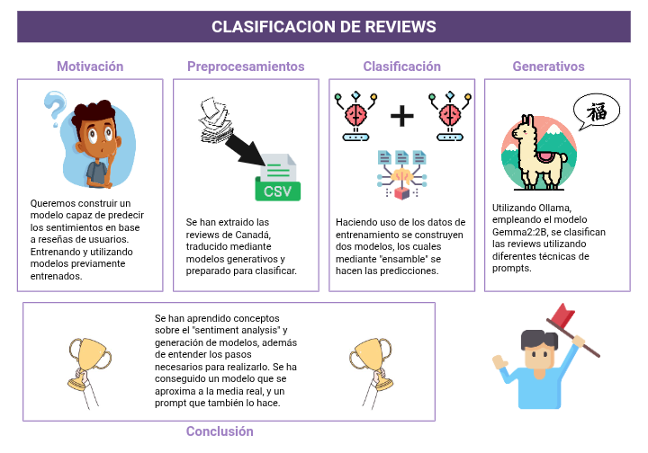

# 📊 Clasificación de Reseñas: Modelos Clásicos y Generativos

Bienvenido/a a este proyecto de *Clasificación de Reseñas*, donde exploramos dos enfoques diferentes para el análisis de sentimientos:  
- 🔧 **Modelos tradicionales supervisados entrenados**  
- 🧠 **Modelos generativos de última generación**

El objetivo es comparar el rendimiento, eficiencia y resultados interpretables de ambos métodos en el contexto del análisis de texto aplicado a reseñas de usuarios.

---

## 📌 Estructura del Proyecto

Este repositorio contiene varios componentes clave:

- Clasificación — Modelos clásicos entrenados para clasificación (como SVM, Random Forest, etc.).
- Generativos — Modelos generativos (oLlama) adaptados a la clasificación.
- SAD.png — Un resumen visual del proyecto, ideal para presentaciones rápidas o papers.
- Tableau.pdf — Un análisis narrativo comparando **Canadá 🇨🇦** (nuestro país de enfoque) y **Australia 🇦🇺** (competidor) a través de visualizaciones y datos.

> 📁 Las instrucciones específicas para ejecutar o probar los componentes están **dentro de cada carpeta**.

---

## 📷 Vista Previa

  
*Resumen visual del flujo del proyecto.*

---

## 🤝 Contribuciones

¡Contribuciones y sugerencias son bienvenidas! Si deseas aportar mejoras, abre un issue o un pull request 🚀

---

